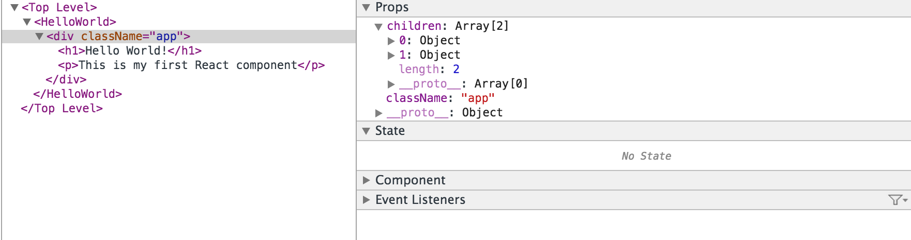

## Part 1: Getting started with ReactJS


### What is ReactJS?
- React is a JS library for creating UIs.
- Created by Facebook
- Used for creating components
- Lots of people use React as the V in MVC
- It is NOT a template library (handlebar.js, mustache.js, ...)

### Why ReactJS?
- It is alternative to EVENT-BASED and DATA BINDING approaches
- Avoids keeping track of which callback gets called first
- COMPONENTS
  - Re-rendering every time a change is made
  - Easier to reason about
- Improved performance

### Virtual DOM
- Solution for unpredictable UI
- Solves the following issues of data binding
  - bind data-models to views
  - non trivial abstraction
  - key-value observation
  - observables & computed properties
  - observables - values which when are changed they notify other observables
  computed properties - are observables which contain
  the computed change
  - problem with this system is that it needs to
  maintain a dependency graph of observable and computed graphs

- vDOM - no need for observables
- whenever change occurs => re-render everything to a vDOM representation
- DIFF the previous vDOM with the latest
- Update the real DOM with ONLY the changed stuff

### Performance:
O(v) O(m)
v - size of view
m - size of models
v << m

|        | Data binding | Virtual DOM|
|--------|:------------:|:----------:|
|memory  | O(m)         | O(v)       |
|runtime | O(1)         | O(v)       |


---
### Your First Component

```js
class HelloWorld extends React.Component {
  render() {
    return (<h1>Hello World!</h1>);
  }
}

```
We can render the component into an existing DOM element:

```js

React.render(<HelloWorld />, document.getElementsByTagName('body')[0]);

```
**[Run Code](http://jsfiddle.net/w852f40j/)**

---
### render()

  In a React component the render function is used to describe the actually DOM the component should generate. When called, the render method will return a single child element.

  That element can either be a DOM element, another React component your've defined elsewhere, or null/false if you don't want anything rendered.

  **The render() method is required.**

---
#### :dart: ES6 Tip - Use ES6 Classes :dart:

Up until recently (see [React v0.13.0 Beta 1](https://facebook.github.io/react/blog/2015/01/27/react-v0.13.0-beta-1.html)) the default way of creating react components was to use the React.createClass method.

```js
//React Objects
var MyComponent = React.createClass({
  render: function() {
    return (
      <p>
        My App Component
      </p>
    );
  }
});

```

ES6 introduces classes so we can define a ES6 class that extends React.Component.


```js
//ES6 classes
class MyComponent extends React.Component {
  render() {
    return (
      <p>
        My App Component
      </p>
    );
 }
};
```

---

####  GOTCHA #1

Note that the html in our render function (actually this is JSX, but we will get to that in a second) must be wrapped withing a single root tag.

For example the below would display the following error in the console.


```js
class HelloWorld extends React.Component {
  render() {
    return (<h1>Hello World!</h1>
            <p>This is my first React component</p>);
  }
}

Error  Adjacent JSX elements must be wrapped in an enclosing tag
```

**[Run Code](http://jsfiddle.net/cp8bpzk4/)**

---

Adding a div wrapper would fix this issue...

```js
class HelloWorld extends React.Component {
  render() {
    return (<div className='app'>
              <h1>Hello World!</h1>
              <p>This is my first React component</p>
            </div>);
  }
}
```

**[Run Code](http://jsfiddle.net/164zhyLa/)**

---

####  GOTCHA #2

In the above example I've added a className to the div of our component - but wait className not class?


React using the property className, at first I forgot about this alot and used class instead - this is usually a common mistake when starting out.


```js
class HelloWorld extends React.Component {
  render() {
    return (<div class='app'>
              <h1>Hello World!</h1>
              <p>This is my first React component</p>
            </div>);
  }
}
```

Luckly React has some amazing console warning/error logging to help keep us productive.


```
Warning: Unknown DOM property class. Did you mean className?
```


**[Run Code](http://jsfiddle.net/1vhfhy6b/)**

---


### JSX Syntax

In our render functions we've been using JSX to build out our DOM.

This is a just syntactic sugar that gets transcompiled using babel to plain JavaScript:


```js
class HelloWorld extends React.Component {
  render() {
     return React.createElement('div', {className: 'app'},
              React.createElement('h1', null, 'Hellow World!'),
              React.createElement('p', null, 'This is my first React component')
            );
  }
}

React.render(
  React.render(<HelloWorld />, document.getElementsByTagName('body')[0]);
);
```


**[Run Code](http://jsfiddle.net/hff3s3hp/)**

Some prefer to just use React without JSX, its completely optional, but it's there to make our lives easier.

---

#### :dart: ES6 Tip - Use ES6  Import / Export :dart:

Since we don't want to have all our components living in the same file it make sense to break them up into modules and ```require``` them where needed.

Since we are using babel and have the benfit to use ES6 it makes sense to move away from ```require``` and towards ES6 modules.

In the case about, we could create a HelloWorld.js file, add our compoent class and we ensure to export the module...


```js
// helloWorld.js

import React from 'react';

export class HelloWorld extends React.Component {
  render() {
    return (<div className='app'>
              <h1>Hello World!</h1>
              <p>This is my first React component</p>
            </div>);
  }
}
```

And in our main app.js file, we can import this module.

```js
// app.js

import React from 'react';
import HelloWorld from './hellowWorld';

React.render(<HelloWorld />, document.getElementsByTagName('body')[0]);
```

Similarly, if we wanted to include 3rd party library we would take this appoarch.

```
npm install --save lodash
```

And in our helloWorld.js we can include it:


```js
// helloWorld.js

import React from 'react';
import _ from 'lodash';

export class HelloWorld extends React.Component {
  render() {
    return (<div className='app'>
              <h1>Hello World!</h1>
              <p>This is my first React component</p>
            </div>);
  }
}

```


---


### CSS/Sass with React

You may be thinking, how can we include our some styles into our app?

Say we have the following css...

```
// main.css
.app {
  background: tomato;
}
```

Well, just like how we import libarays and components we can import css/sass.

```
import './main.css';

export class HelloWorld extends React.Component {
  render() {
    return (<div className='app'>
              <h1>Hello World!</h1>
              <p>This is my first React component</p>
            </div>);
  }
}
```


---

### React DeBugger Tool - walkthrough



---

### Lifecycle Methods

Render of course is not the only React function we extend from ```React.Component```.

Below is a list of (optional) lifecycle methods avaiable to us. These fire at different times during the 'lifecycle' of your components.


```js
class HelloWorld extends React.Component {

  componentWillMount() {
  }

  componentDidMount() {
  }

  componentWillReceiveProps(nextProps) {
  }

  shouldComponentUpdate(nextProps, nextState) {
    return true;
  }

  componentWillUpdate(nextProps, nextState) {
  }

  componentDidUpdate(prevProps, prevState) {
  }

  componentWillUnmount() {
  }

}
```

**componentWillMount()**

>Invoked once, both on the client and server, immediately before the initial rendering occurs. If you call setState within this method, render() will see the updated state and will be executed only once despite the state change.

--

**componentDidMount()**

>Invoked once, only on the client (not on the server), immediately after the initial rendering occurs. At this point in the lifecycle, the component has a DOM representation which you can access via React.findDOMNode(this).

Use Case:

- If you want to integrate with other JavaScript frameworks, set timers using setTimeout or setInterval, or send AJAX requests, perform those operations in this method.


--

**componentWillReceiveProps()**

>Invoked when a component is receiving new props. This method is not called for the initial render.

Use Case:

- Use this as an opportunity to react to a prop transition before render() is called by updating the state using this.setState(). The old props can be accessed via this.props. Calling this.setState() within this function will not trigger an additional render.

--

**shouldComponentUpdate()**

>Invoked before rendering when new props or state are being received. This method is not called for the initial render or when forceUpdate is used.

Use Case:

- Use this as an opportunity to return false when you're certain that the transition to the new props and state will not require a component update.

--

**componentWillUpdate()**

>Called immediately before rendering when new props or state are being received. This method is not called for the initial render.

User Cases:

- Use this as an opportunity to perform preparation before an update occurs.
- NOTE: You cannot use this.setState() in this method. If you need to update state in response to a prop change, use componentWillReceiveProps instead.

--

**componentDidUpdate()**

>Called immediately after the component updates are pushed to the DOM, but not called for the initial render.

Use Cases:

  -  Use this as an opportunity to operate on the DOM when the component has been updated.

--

**componentWillUnmount()**

>Called immediately before a component is unmounted from the DOM.

Use Cases:

  - Perform any necessary cleanup
  - invalidating timers or cleaning up any DOM elements that were created in componentDidMount.
