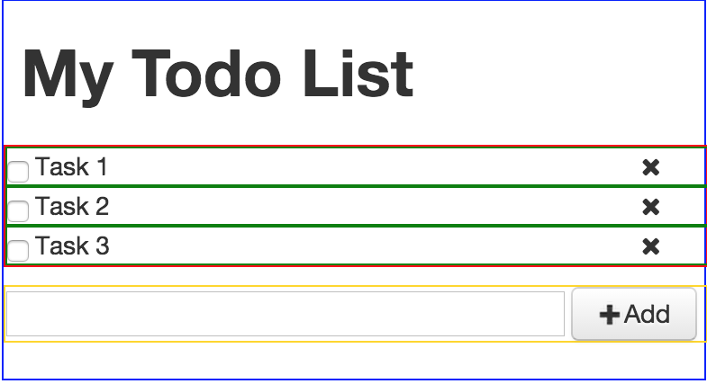
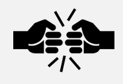

# Part 2: Composing components


Lets build a todo list app.

First lets break down our app into module, compassable components. For the todo app example, we will have the following structure.



 - ToDo App
  - Todo Title
  - Todo Items
    - Todo Item 1
    - Todo Item 2
  - Todo Add


```js
// todo-item.js

import React from 'react';

export class TodoItem extends React.Component {
  render() {
    return (
        <div>Todo Item</div>
    );
  }
}
```

```js
// todo-add.js

import React from 'react';

export class TodoAdd extends React.Component {
  render() {
    return (
      <div>
        <input type='text' placeholder='Add a item!'/>
      </div>
    );
  }
}
```

Next, update the ToDo component to use these new components:


```js
// app.js

import React from 'react';
import TodoItem from './todo-item';
import TodoAdd from './todo-add';

class Todo extends React.Component {
  render() {
    return (
      <div>
    <h1>My Grocery List</h1>
        <TodoItem />
        <TodoItem />
        <TodoItem />
        <TodoAdd />
      </div>
    );
  }
}
```

**[Run Code](http://jsfiddle.net/e3e9e7x4/)**


---
### Props - Lets talk about PROPS



Before we go any further we need to look at Component Properties.

Think of Components as Functions and props as parameters for that function. Props allow us to pass data and functions ‘downstream’ to components.

This is a core idea in React - building components that communicate top-down, in a uni-data-direction flow vibe.
  - expand on this!

#### Props Anti-Pattern
- Mutating the props could cause unexpected consequences
-  more?


--
#### Props - Passing Data

Here is a example of how we could pass three properties (color, x and y) into a react component, in this case, MyComponent.

```js
var pos = {
  x: 123,
  y: 34
};

<MyComponent color={'green'}
             x={pos.x}
             y={pos.y} />
```


MyComponent would now have access to color, x and y.

```
this.props.color
this.props.x
this.props.y
```

**[Run Code](http://jsfiddle.net/hL27Lug6/)**

---

With props you also have access to the children of a component. For example, if we alter the above example a bit..


```js
var pos = {
  x: 123,
  y: 34
};

<MyComponent color={'green'}
             x={pos.x}
             y={pos.y}>
   Hello!
</MyComponent>
```

I could access the content within MyComponent ```this.props.children```

**[Run Code](http://jsfiddle.net/as93se5c/)**

---


#### Props - Passing Functions

... TBD

---

#### :dart: ES6 Tip - Use Spread Operator (...props) :dart:

The .... ... .... ....


```js
var props = {
  color: 'white',
  x: 123,
  y: 34
};

var myComp = <MyComponent {...props} />
```


---

#### propTypes

propTypes allow you to define the type of data that should be passed through props.

```js
TodoList.propTypes = {
  item: React.PropTypes.array,
  active: React.PropTypes.bool
};
```

- When an invalid value is provided for a prop, a warning will be shown in the JavaScript console.


``` <TodoList item=[] active='true' />```

```
ERROR:
````

Since TodoList was expecting active to be bool and not a string, a warning will be shown.

You can chain any propType with `isRequired` to make sure a warning is shown if the prop isn't provided.

```js
TodoList.propTypes = {
  item: React.PropTypes.array
  active: React.PropTypes.bool.isRequired
};

```

``` <TodoList item=[]/>```

```
ERROR:
````


---

#### defaultProps

```js
Todo.defaultProps = { list: [] };

```

 - React lets you define default values for your props
 - In the above list will be cached as a empty array.  this.props.list will be empty  instead of null if nothing is specified by the parent component

---

#### Back to Todo


- build app
- build app
- build app
- build app
- build app
- build app
- build app
- build app
- build app
- build app
- build app
- build app
- build app
- build app
- build app
- build app
- build app
- build app

---

#### :dart: ES6 Tip - Use Arrow Functions :dart:

```js
var self = this;   // called immediately after render()

{this.props.todos.map(function(todo, index) {
  return <tbody key={index}>
           <TodoRow todo={todo}
                    editClicked={self.editClicked}
                    deleteClicked={self.deleteClicked} />
         </tbody>;
})}
```

```js
{this.props.todos.map((todo, index) => {
  return <tbody key={index}>
           <TodoRow todo={todo}
                    editClicked={this.editClicked}
                    deleteClicked={this.deleteClicked} />
         </tbody>;
})}

```

---

### Lets talk about STATE


This works but is BAD. THe problem is we are storing our app-state (The list of todo's) within a sub component. When working with React we always want to be thinking in terms of app-state data being contain at the highest component level. In this way, our state will flow downstream towards all the component under the root component. This makes the state of our app easy to reason about. The result is that data moves from top to bottom. If we need to update data, we pass a message upwards to the root componment, to notify it to update the state. Once that state is update, React will pass along this data donwstream, and update all the components that change.

>"Where state should be stored?"


"Understanding where state should be stored."
  — At the ROOT!
unless you need local state for complaints (STUFF you won’t want in GLOBAL STATE!!! drag/drop X/Y doesn’t need to be in app-state until mouse down)
Source of truth is at the top level, and everything is passed down
reasonability


Of course to make this workable, we need to discuss and implmenet another two core principles of any React applications - **State and Props**


```
  constructor(props) {
    super(props);
  }
```


 - keep state at the ROOT of your app.
 - pass state down through props
 - access state as ready only on props (why is that good?)
 - use function pass downstream to alter state

 events can be used to hook into good stuff, onClick, onKeyDown, etc, etc
- see - https://facebook.github.io/react/docs/events.html
- refs are great for hooking into dom
- ES6 spread helpful with props


  - PASS a list item downstream to TodoList
  - SHOW this.props.whatever + this.props.children

props used to pass functions that act on state ‘downstream’ to components
  - PASS a func downstream to TodoList
  - SHOW this.props.test.bind(this)
  - show ALTERNATE whay

